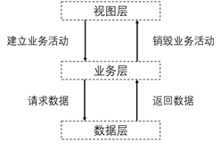

# Android开发

日期：2018/8/1

作者：易士翔(yishixiang@gmail.com)

版本：1.0

------

[TOC]

------


## 1. 学习路线

学习路线主要包含Java部分和Android端开发部分

### 1.1 Java部分

- 第一阶段
  - Java基础：Java常见的8种数据类型和引用类型、基本运算符、条件分支语句、反射（掌握）、异常（掌握）、常见的集合类（重点）、IO操作（重点）、基本网络通信（掌握）。
  - 开发环境：Eclipse（会使用Eclipse创建项目、运行项目、安装插件、调试代码、熟悉其基本配置、了解常见项目目录结构和组织形式等），**IDEA**（目前Java领域最智能的开发环境）。
  - 数据库：MySQL（安装、基本原理、增删改查SQL的使用、数据库范式的了解，高级查询语句的使用，基本的MySQL系统配置等）；使用JDBC实现Java操作数据库；Navicat（MySQL可视化工具，熟练使用）
- 第二阶段
  - Java多线程：多线程（重点）、锁、线程间通信机制、线程池、重入锁、无锁CAS、Java8并发包等。
  - 设计模式（掌握）：23种设计模式，常用的单例模式、工厂模式、适配器模式、装饰器模式、代理模式等。
  - JVM（了解）：什么是JVM、运行时内存区域、垃圾回收算法、类加载器、类加载机制、性能优化等。
- 推荐书籍：
  - 《Java核心技术（卷一）》、《Java并发编程实战》、《深入理解Java虚拟机：JVM高级特性与最佳实践》、《Java编程思想》
  - 《大话设计模式》、《 设计模式 可复用面向对象软件的基础》、《重构：改善既有代码的设计》

### 1.2 Android部分

- 第一阶段：Android开发环境搭建（推荐Android Studio），了解Android应用程序目录结构及四大组件（Activity、Service、Broadcast Receiver、Content Provider）
- 第二阶段：掌握基本布局方法（线性布局、相对布局、帧布局、百分比布局），掌握基础UI组件（TextView、Button、EditText、ImageView、ProgressBar），熟悉高级UI组件（ListView、CommonAdapter、RecyclerView、Fragment）
- 第三阶段：选择掌握数据存储方案（SharedPreference、SQLite、LitePal）、掌握网络编程基础，选择掌握相关开源工具（HttpURLConnection、OKHttp、OKHttpUtils、JSON数据解析），了解相关消息推送机制
- 第四阶段：掌握相关版本控制与协作开发工具（Github）、掌握Android应用发布工具（签名打包、发布应用）
- 推荐书籍：
  - 《第一行代码:Android(第2版)》、《Android编程权威指南(第3版)》、《疯狂Android讲义（第3版）》、《Android进阶之光》

## 2. Android入门介绍

### 2.1 Activity

`Activity` 是一个应用组件，用户可与其提供的屏幕进行交互，以执行拨打电话、拍摄照片、发送电子邮件或查看地图等操作。 每个 Activity 都会获得一个用于绘制其用户界面的窗口。窗口通常会充满屏幕，但也可小于屏幕并浮动在其他窗口之上。

一个应用通常由多个彼此松散联系的 Activity 组成。 一般会指定应用中的某个 Activity 为“主”Activity，即首次启动应用时呈现给用户的那个 Activity。 而且每个 Activity 均可启动另一个 Activity，以便执行不同的操作。 每次新 Activity 启动时，前一 Activity 便会停止，但系统会在堆栈（“返回栈”）中保留该 Activity。 当新 Activity 启动时，系统会将其推送到返回栈上，并取得用户焦点。 返回栈遵循基本的“后进先出”堆栈机制，因此，当用户完成当前 Activity 并按“返回”按钮时，系统会从堆栈中将其弹出（并销毁），然后恢复前一 Activity。 （[任务和返回栈](https://developer.android.google.cn/guide/components/tasks-and-back-stack.html)文档中对返回栈有更详细的阐述。）

当一个 Activity 因某个新 Activity 启动而停止时，系统会通过该 Activity 的生命周期回调方法通知其这一状态变化。Activity 因状态变化—系统是创建 Activity、停止 Activity、恢复 Activity 还是销毁 Activity— 而收到的回调方法可能有若干种，每一种回调都会为您提供执行与该状态变化相应的特定操作的机会。 例如，停止时，您的 Activity 应释放任何大型对象，例如网络或数据库连接。 当 Activity 恢复时，您可以重新获取所需资源，并恢复执行中断的操作。 这些状态转变都是 Activity 生命周期的一部分。

**创建Activity**

要创建 Activity，您必须创建 `Activity` 的子类（或使用其现有子类）。您需要在子类中实现 Activity 在其生命周期的各种状态之间转变时（例如创建 Activity、停止 Activity、恢复 Activity 或销毁 Activity 时）系统调用的回调方法。 两个最重要的回调方法是：

- onCreate()

  您必须实现此方法。系统会在创建您的 Activity 时调用此方法。您应该在实现内初始化 Activity 的必需组件。 最重要的是，您必须在此方法内调用`setContentView()`，以定义 Activity 用户界面的布局。

- onPause()

  系统将此方法作为用户离开 Activity 的第一个信号（但并不总是意味着 Activity 会被销毁）进行调用。 您通常应该在此方法内确认在当前用户会话结束后仍然有效的任何更改（因为用户可能不会返回）。

您还应使用几种其他生命周期回调方法，以便提供流畅的 Activity 间用户体验，以及处理导致您的 Activity 停止甚至被销毁的意外中断。

**实现用户界面**

Activity 的用户界面是由层级式视图 — 衍生自 `View` 类的对象 — 提供的。每个视图都控制 Activity 窗口内的特定矩形空间，可对用户交互作出响应。 例如，视图可以是在用户触摸时启动某项操作的按钮。

您可以利用 Android 提供的许多现成视图设计和组织您的布局。“小部件”是提供按钮、文本字段、复选框或仅仅是一幅图像等屏幕视觉（交互式）元素的视图。 “布局”是衍生自 `ViewGroup` 的视图，为其子视图提供唯一布局模型，例如线性布局、网格布局或相对布局。 您还可以为 `View` 类和 `ViewGroup` 类创建子类（或使用其现有子类）来自行创建小部件和布局，然后将它们应用于您的 Activity 布局。

利用视图定义布局的最常见方法是借助保存在您的应用资源内的 XML 布局文件。这样一来，您就可以将用户界面的设计与定义 Activity 行为的源代码分开维护。 您可以通过 `setContentView()` 将布局设置为 Activity 的 UI，从而传递布局的资源 ID。不过，您也可以在 Activity 代码中创建新 `View`，并通过将新 `View` 插入 `ViewGroup` 来创建视图层次，然后通过将根 `ViewGroup` 传递到 `setContentView()` 来使用该布局。

如需了解有关创建用户界面的信息，请参阅[用户界面](https://developer.android.google.cn/guide/topics/ui/index.html)文档。

**在清单文件中声明 Activity**

您必须在清单文件中声明您的 Activity，这样系统才能访问它。 要声明您的 Activity，请打开您的清单文件，并将`<activity>`元素添加为`<application>`元素的子项。例如：

> ```xml
> <manifest ... >
>   <application ... >
>       <activity android:name=".ExampleActivity" />
>       ...
>   </application ... >
>   ...
> </manifest >
> ```

您还可以在此元素中加入几个其他特性，以定义 Activity 标签、Activity 图标或风格主题等用于设置 Activity UI 风格的属性。 [`android:name`](https://developer.android.google.cn/guide/topics/manifest/activity-element.html#nm) 属性是唯一必需的属性—它指定 Activity 的类名。应用一旦发布，即不应更改此类名，否则，可能会破坏诸如应用快捷方式等一些功能。

**启动Activity**

您可以通过调用 `startActivity()`，并将其传递给描述您想启动的 Activity 的 `Intent` 来启动另一个 Activity。Intent 对象会指定您想启动的具体 Activity 或描述您想执行的操作类型（系统会为您选择合适的 Activity，甚至是来自其他应用的 Activity）。 Intent 对象还可能携带少量供所启动 Activity 使用的数据。

在您的自有应用内工作时，您经常只需要启动某个已知 Activity。 您可以通过使用类名创建一个显式定义您想启动的 Activity 的 Intent 对象来实现此目的。 例如，可以通过以下代码让一个 Activity 启动另一个名为 `SignInActivity` 的 Activity：

`Intent intent = new Intent(this, SignInActivity.class);`

`startActivity(intent); `

不过，您的应用可能还需要利用您的 Activity 数据执行某项操作，例如发送电子邮件、短信或状态更新。 在这种情况下，您的应用自身可能不具有执行此类操作所需的 Activity，因此您可以改为利用设备上其他应用提供的 Activity 为您执行这些操作。 这便是 Intent 对象的真正价值所在 — 您可以创建一个 Intent 对象，对您想执行的操作进行描述，系统会从其他应用启动相应的 Activity。 如果有多个 Activity 可以处理 Intent，则用户可以选择要使用哪一个。 例如，如果您想允许用户发送电子邮件，可以创建以下 Intent：

> ```java
> Intent intent = new Intent(Intent.ACTION_SEND);
> intent.putExtra(Intent.EXTRA_EMAIL, recipientArray);
> startActivity(intent);
> ```

**结束Activity**

可以通过调用 Activity 的 `finish()` 方法来结束该 Activity。您还可以通过调用 `finishActivity()` 结束您之前启动的另一个 Activity。

**注**：在大多数情况下，您不应使用这些方法显式结束 Activity。 正如下文有关 Activity 生命周期的部分所述，Android 系统会为您管理 Activity 的生命周期，因此您无需结束自己的 Activity。 调用这些方法可能对预期的用户体验产生不良影响，因此只应在您确实不想让用户返回此 Activity 实例时使用。

Activity在其生命周期中最多可能有4种状态。

1. 运行状态

   当一个活动位于返回栈的栈顶是，这时活动就处于运行状态。

2. 暂停状态

   当一个活动不再处于栈顶位置，但仍然可见是，这时活动就进入了暂停状态。处于暂停状态的活动仍然是完全存活着的，但是只有在内存极低的情况下，系统才会去考虑回收这种活动。

3. 停止状态

   当一个活动不再处于栈顶位置，并且完全不可见的时候，就进入了停止状态。系统仍然会为这种活动保存相应的状态和成员变量，但是这并不是完全可靠的，当其他地方需要内存时，处于停止状态的活动有可能会被系统回收。

4. 销毁状态

   当一个活动从返回栈中移除后就变成了销毁状态。

   Activity类中定义了7个回调方法，覆盖了活动生命周期的每一个环节。

   - `onCreate()` 在活动第一次被创建的时候调用，在这个方法中完成活动的初始化操作，比如加载布局、绑定时间等。
   - `onStart()` 这个方法在活动由不可见变为课件的时候调用。
   - `onResume()` 这个方法在活动准备好和用户进行交互的时候调用，此时的活动一定位于返回栈的栈顶，并且处于运行状态。
   - `onPause()` 这个方法在系统准备去启动或者恢复另一个活动的时候调用。
   - ` onStop()` 这个方法在活动完全不可见的时候调用。它和onPause方法的主要区别在于，如果启动的新活动是一个对话框式的活动，那么onPause方法会得到执行，而onStop方法并不会执行。
   - `onDestroy()` 这个方法在活动被销毁之前调用，之后活动的状态将变为销毁状态。
   - `onRestart()` 这个方法在活动由停止状态变为运行状态之前调用，也就是活动被重新启动

活动完整的生命周期运行路线如下图所示， 


### 2.2 Service

Service是Android中实现程序后台运行的解决方案，它非常适用于去执行那些不需要和用户交互而且还要求长期运行的任务。Service默认并不会运行在子线程中，它也不运行在一个独立的进程中，它同样执行在UI线程中，因此，不要在Service中执行耗时的操作，除非你在Service中创建了子线程来完成耗时操作。

Service的运行不依赖于任何用户界面，即使程序被切换到后台或者用户打开另一个应用程序，Service仍然能够保持正常运行，这也正是Service的使用场景。当某个应用程序进程被杀掉时，所有依赖于该进程的Service也会停止运行。

`Service`可按照运行地点、运行类型 & 功能进行分类，具体如下：


 

**不可交互的后台服务**即是普通的Service，Service的生命周期很简单，分别为`onCreate`、`onStartCommand`、`onDestroy`这三个。当我们`tartService()`的时候，首次创建Service会回调`onCreate()`方法，然后回调`onStartCommand()`方法，再次`startService()`的时候，就只会执行一次`onStartCommand()`。服务一旦开启后，我们就需要通过`stopService()`方法或者`stopSelf()`方法，就能把服务关闭，这时就会回调`onDestroy()`

**注**：Service也是四大组件之一，所以必须在manifests中配置。

**可交互的后台服务**是指前台页面可以调用后台服务的方法，可交互的后台服务实现步骤是和不可交互的后台服务实现步骤是一样的，区别在于启动的方式和获得Service的代理对象 。

**前台服务**：由于后台服务优先级相对比较低，当系统出现内存不足的情况下，它就有可能会被回收掉，所以前台服务就是来弥补这个缺点的，它可以一直保持运行状态而不被系统回收。例如：墨迹天气在状态栏中的天气预报。

### 2.3 Android Broadcast Receiver

广播接收器用于响应来自其他应用程序或者系统的广播消息。这些消息有时被称为事件或者意图。例如，应用程序可以初始化广播来让其他的应用程序知道一些数据已经被下载到设备，并可以为他们所用。这样广播接收器可以定义适当的动作来拦截这些通信。

有以下两个重要的步骤来使系统的广播意图配合广播接收器工作。

- 创建广播接收器
- 注册广播接收器

Android广播分为两个方面：广播发送者和广播接收者，通常情况下，BroadcastReceiver指的就是广播接收者（广播接收器）。广播作为Android组件间的通信方式，可以使用的场景如下：
1.同一app内部的同一组件内的消息通信（单个或多个线程之间）；

2.同一app内部的不同组件之间的消息通信（单个进程）；

3.同一app具有多个进程的不同组件之间的消息通信；

4.不同app之间的组件之间消息通信；

5.Android系统在特定情况下与App之间的消息通信。

从实现原理看上，Android中的广播使用了观察者模式，基于消息的发布/订阅事件模型。因此，从实现的角度来看，Android中的广播将广播的发送者和接受者极大程度上解耦，使得系统能够方便集成，更易扩展。具体实现流程要点粗略概括如下：

1.广播接收者BroadcastReceiver通过Binder机制向AMS(Activity Manager Service)进行注册；

2.广播发送者通过binder机制向AMS发送广播；

3.AMS查找符合相应条件（IntentFilter/Permission等）的BroadcastReceiver，将广播发送到BroadcastReceiver（一般情况下是Activity）相应的消息循环队列中；

4.消息循环执行拿到此广播，回调BroadcastReceiver中的`onReceive()`方法。

 对于不同的广播类型，以及不同的BroadcastReceiver注册方式，具体实现上会有不同。但总体流程大致如上。

由此看来，广播发送者和广播接收者分别属于观察者模式中的消息发布和订阅两端，AMS属于中间的处理中心。广播发送者和广播接收者的执行是异步的，发出去的广播不会关心有无接收者接收，也不确定接收者到底是何时才能接收到。显然，整体流程与EventBus非常类似。

在上文说列举的广播机制具体可以使用的场景中，现分析实际应用中的**适用性**：

第一种情形：同一app内部的同一组件内的消息通信（单个或多个线程之间），实际应用中肯定是不会用到广播机制的（虽然可以用），无论是使用扩展变量作用域、基于接口的回调还是Handler-post/Handler-Message等方式，都可以直接处理此类问题，若适用广播机制，显然有些“杀鸡牛刀”的感觉，会显太“重”；

第二种情形：同一app内部的不同组件之间的消息通信（单个进程），对于此类需求，在有些教复杂的情况下单纯的依靠基于接口的回调等方式不好处理，此时可以直接使用EventBus等，相对而言，EventBus由于是针对统一进程，用于处理此类需求非常适合，且轻松解耦。

第三、四、五情形：由于涉及不同进程间的消息通信，此时根据实际业务使用广播机制会显得非常适宜。下面主要针对Android广播中的具体知识点进行总结。 

**自定义BroadcastReceiver**

自定义广播接收器需要继承基类BroadcastReceivre，并实现抽象方法onReceive(context, intent)方法。广播接收器接收到相应广播后，会自动回到`onReceive(..)`方法。默认情况下，广播接收器也是运行在UI线程，因此，onReceive方法中不能执行太耗时的操作。否则将因此ANR。一般情况下，根据实际业务需求，onReceive方法中都会涉及到与其他组件之间的交互，如发送Notification、启动service等。
下面代码片段是一个简单的广播接收器的自定义：

> ```java
> public class MyBroadcastReceiver extends BroadcastReceiver {
>     public static final String TAG = "MyBroadcastReceiver";
>     public static int m = 1;
> 
>     @Override
>     public void onReceive(Context context, Intent intent) {
>         Log.w(TAG, "intent:" + intent);
>         String name = intent.getStringExtra("name");
>         Log.w(TAG, "name:" + name + " m=" + m);
>         m++;
>         
>         Bundle bundle = intent.getExtras();
>         
>     }
> }
> ```

**BroadcastReceiver注册类型**

BroadcastReceiver总体上可以分为两种注册类型：静态注册和动态注册。

- 静态注册：

  直接在AndroidManifest.xml文件中进行注册。规则如下：

  > ```xml
  > <receiver android:enabled=["true" | "false"]
  > android:exported=["true" | "false"]
  > android:icon="drawable resource"
  > android:label="string resource"
  > android:name="string"
  > android:permission="string"
  > android:process="string" >
  > . . .
  > </receiver>
  > ```

  其中，需要注意的属性 android:exported  ——此broadcastReceiver能否接收其他App的发出的广播，这个属性默认值有点意思，其默认值是由receiver中有无intent-filter决定的，如果有intent-filter，默认值为true，否则为false。（同样的，activity/service中的此属性默认值一样遵循此规则）同时，需要注意的是，这个值的设定是以application或者application user id为界的，而非进程为界（一个应用中可能含有多个进程）； 

  android:name  —— 此broadcastReceiver类名；

  android:permission  ——如果设置，具有相应权限的广播发送方发送的广播才能被此broadcastReceiver所接收； 

  android:process  ——broadcastReceiver运行所处的进程。默认为app的进程。可以指定独立的进程（Android四大基本组件都可以通过此属性指定自己的独立进程） 

  常见的注册形式有： 

  > ```xml
  > <receiver android:name=".MyBroadcastReceiver" >
  >     <intent-filter>
  >         <action android:name="android.net.conn.CONNECTIVITY_CHANGE" />
  >     </intent-filter>
  >     <intent-filter>
  >         <action android:name="android.intent.action.BOOT_COMPLETED" />
  >     </intent-filter>
  > </receiver>
  > ```

  其中，intent-filter由于指定此广播接收器将用于接收特定的广播类型。本示例中给出的是用于接收网络状态改变或开启启动时系统自身所发出的广播。当此App首次启动时，系统会自动实例化MyBroadcastReceiver，并注册到系统中。

  之前常说：静态注册的广播接收器即使app已经退出，主要有相应的广播发出，依然可以接收到，但此种描述自Android 3.1开始有可能不再成立，具体分析详见本文后面部分。

- 动态注册

  动态注册时，无须在AndroidManifest中注册`<receiver/>`组件。直接在代码中通过调用Context的registerReceiver函数，可以在程序中动态注册BroadcastReceiver。registerReceiver的定义形式如下： 

  `registerReceiver(BroadcastReceiver receiver, IntentFilter filter)`

  `registerReceiver(BroadcastReceiver receiver, IntentFilter filter, String broadcastPermission, Handler scheduler)`

  典型的写法示例如下： 

  > ```java
  > public class MainActivity extends Activity {
  >     public static final String BROADCAST_ACTION = "com.example.corn";
  >     private BroadcastReceiver mBroadcastReceiver;
  > 
  >     @Override
  >     protected void onCreate(Bundle savedInstanceState) {
  >         super.onCreate(savedInstanceState);
  >         setContentView(R.layout.activity_main);
  > 
  >         mBroadcastReceiver = new MyBroadcastReceiver();
  >         IntentFilter intentFilter = new IntentFilter();
  >         intentFilter.addAction(BROADCAST_ACTION);
  >         registerReceiver(mBroadcastReceiver, intentFilter);
  >     }
  >     
  >     @Override
  >     protected void onDestroy() {
  >         super.onDestroy();
  >         unregisterReceiver(mBroadcastReceiver);
  >     }
  > 
  > }
  > ```

  注：Android中所有与观察者模式有关的设计中，一旦涉及到register，必定在相应的时机需要unregister。因此，上例在onDestroy()回到中需要unregisterReceiver(mBroadcastReceiver)。

  当此Activity实例化时，会动态将MyBroadcastReceiver注册到系统中。当此Activity销毁时，动态注册的MyBroadcastReceiver将不再接收到相应的广播。

**广播发送及广播类型** 

经常说”发送广播“和”接收“，表面上看广播作为Android广播机制中的实体，实际上这一实体本身是并不是以所谓的”广播“对象存在的，而是以”意图“（Intent）去表示。定义广播的定义过程，实际就是相应广播”意图“的定义过程，然后通过广播发送者将此”意图“发送出去。被相应的BroadcastReceiver接收后将会回调`onReceive()`函数。

下段代码片段显示的是一个普通广播的定义过程，并发送出去。其中`setAction(..)`对应于BroadcastReceiver中的intentFilter中的action。

> ```java
> Intent intent = new Intent();
> intent.setAction(BROADCAST_ACTION);
> intent.putExtra("name", "qqyumidi");
> sendBroadcast(intent);
> ```

根据广播的发送方式，可以将其分为以下几种类型：

1. Normal Broadcast：普通广播
2. System Broadcast: 系统广播
3. Ordered broadcast：有序广播
4. Sticky Broadcast：粘性广播(在 android 5.0/api 21中deprecated,不再推荐使用，相应的还有粘性有序广播，同样已经deprecated)
5. Local Broadcast：App应用内广播

下面分别总结下各种类型的发送方式及其特点。

**Normal Broadcast：普通广播**

此处将普通广播界定为：开发者自己定义的intent，以context.sendBroadcast_"AsUser"(intent, ...)形式。具体可以使用的方法有：
`sendBroadcast(intent)`/`sendBroadcast(intent, receiverPermission)`/`sendBroadcastAsUser(intent, userHandler)`/`sendBroadcastAsUser(intent, userHandler,receiverPermission)`。
普通广播会被注册了的相应的感兴趣（intent-filter匹配）接收，且顺序是无序的。如果发送广播时有相应的权限要求，BroadCastReceiver如果想要接收此广播，也需要有相应的权限。

**System Broadcast: 系统广播**

Android系统中内置了多个系统广播，只要涉及到手机的基本操作，基本上都会发出相应的系统广播。如：开启启动，网络状态改变，拍照，屏幕关闭与开启，点亮不足等等。每个系统广播都具有特定的intent-filter，其中主要包括具体的action，系统广播发出后，将被相应的BroadcastReceiver接收。系统广播在系统内部当特定事件发生时，有系统自动发出。

**Ordered broadcast：有序广播**

有序广播的有序广播中的“有序”是针对广播接收者而言的，指的是发送出去的广播被BroadcastReceiver按照先后循序接收。有序广播的定义过程与普通广播无异，只是其的主要发送方式变为：`sendOrderedBroadcast(intent, receiverPermission, ...)`。

对于有序广播，其主要特点总结如下：

1>多个具当前已经注册且有效的BroadcastReceiver接收有序广播时，是按照先后顺序接收的，先后顺序判定标准遵循为：将当前系统中所有有效的动态注册和静态注册的BroadcastReceiver按照priority属性值从大到小排序，对于具有相同的priority的动态广播和静态广播，动态广播会排在前面。

2>先接收的BroadcastReceiver可以对此有序广播进行截断，使后面的BroadcastReceiver不再接收到此广播，也可以对广播进行修改，使后面的BroadcastReceiver接收到广播后解析得到错误的参数值。当然，一般情况下，不建议对有序广播进行此类操作，尤其是针对系统中的有序广播。

**Sticky Broadcast：粘性广播(在 android 5.0/api 21中deprecated,不再推荐使用，相应的还有粘性有序广播，同样已经deprecated)。**

已经deprecated，此处不再多做总结。

**Local Broadcast：App应用内广播（此处的App应用以App应用进程为界）**

由前文阐述可知，Android中的广播可以跨进程甚至跨App直接通信，且注册是exported对于有intent-filter的情况下默认值是true，由此将可能出现安全隐患如下：

1.其他App可能会针对性的发出与当前App intent-filter相匹配的广播，由此导致当前App不断接收到广播并处理；

2.其他App可以注册与当前App一致的intent-filter用于接收广播，获取广播具体信息。

无论哪种情形，这些安全隐患都确实是存在的。由此，最常见的增加安全性的方案是：

1.对于同一App内部发送和接收广播，将exported属性人为设置成false，使得非本App内部发出的此广播不被接收；

2.在广播发送和接收时，都增加上相应的permission，用于权限验证；

3.发送广播时，指定特定广播接收器所在的包名，具体是通过intent.setPackage(packageName)指定在，这样此广播将只会发送到此包中的App内与之相匹配的有效广播接收器中。

App应用内广播可以理解成一种局部广播的形式，广播的发送者和接收者都同属于一个App。实际的业务需求中，App应用内广播确实可能需要用到。同时，之所以使用应用内广播时，而不是使用全局广播的形式，更多的考虑到的是Android广播机制中的安全性问题。

相比于全局广播，App应用内广播优势体现在：

1.安全性更高；

2.更加高效。

为此，Android v4兼容包中给出了封装好的LocalBroadcastManager类，用于统一处理App应用内的广播问题，使用方式上与通常的全局广播几乎相同，只是注册/取消注册广播接收器和发送广播时将主调context变成了LocalBroadcastManager的单一实例。

代码片段如下

> ```java
> //registerReceiver(mBroadcastReceiver, intentFilter);
> //注册应用内广播接收器
> localBroadcastManager = LocalBroadcastManager.getInstance(this);
> localBroadcastManager.registerReceiver(mBroadcastReceiver, intentFilter);
>         
> //unregisterReceiver(mBroadcastReceiver);
> //取消注册应用内广播接收器
> localBroadcastManager.unregisterReceiver(mBroadcastReceiver);
> 
> Intent intent = new Intent();
> intent.setAction(BROADCAST_ACTION);
> intent.putExtra("name", "qqyumidi");
> //sendBroadcast(intent);
> //发送应用内广播
> localBroadcastManager.sendBroadcast(intent);
> ```

**不同Android API版本中广播机制相关API重要变迁**

- Android5.0/API level 21开始粘滞广播和有序粘滞广播过期，以后不再建议使用；
- ”静态注册的广播接收器即使app已经退出，主要有相应的广播发出，依然可以接收到，但此种描述自Android 3.1开始有可能不再成立“


## 3. 电气火灾系统Android端结构

### 3.1 系统结构概述

- 视图层

  主要提供用户界面展示功能，负责Android移动端界面活动的管理。

- 业务层

  主要完成后台业务逻辑功能的粘合，如人员管理、消防系统数据管理、接单控制等。

- 数据层

  主要完成与远端消防系统数据库交互的功能



**项目依赖**

本项目管理由项目自动化构建工具Gradle构建，具体内容见build.gradle文件。其中Java SDK版本为1.7，Android SDK版本依赖最低版本为21，目标开发SDK版本为23，相关Android SDK版本与Android平台版本对应关系见下表。 

| 平台版本     | SDK Version |
| ------------ | ----------- |
| Android 7.0  | 24          |
| Android 6.0  | 23          |
| Android 5.1  | 22          |
| Android 5.0  | 21          |
| Android 4.4W | 20          |
| Android 4.4  | 19          |
| Android 4.3  | 18          |

### 3.2 模块设计


- #### UI模块

  UI模块主要由各类Activity构成，Activity，Android应用程序组件，提供一个屏幕，用户可以用来交互为了完成某项任务，例如拨号、拍照、发送email、看地图。每一个activity被给予一个窗口，在上面可以绘制用户接口。窗口通常充满屏幕，但也可以小于屏幕而浮于其它窗口之上， 该模块是根据业务逻辑构建的UI。

  

  具体说明见下，

  |           **类名**            |         **描述**          |
  | :---------------------------: | :-----------------------: |
  |       `WelcomeActivity`       | 电气火灾子系统APP欢迎页面 |
  |     `ManagerMainActivity`     |     管理人员权限主页      |
  |     `WeibaoMainActivity`      |     维保人员权限主页      |
  | `SlideMenuForManagerFragment` |   管理人员权限侧滑菜单    |
  |      `SlideMenuFragment`      |   维保人员权限侧滑菜单    |

  在Android项目总，活动（Activity）就是作为包含用户界面的主键，主要用于和用户进行互动。所有的活动都要在AndroidManifest.xml中进行注册才能生效，活动的注册声明要放在<application>标签内，通过<activity>标签来对活动进行注册。该应用的活动注册情况(一部分呢)如下程序清单所示。

  > ```xml
  > <application
  >     android:name="com.equipmentmonitor.UILApplication"
  >     android:allowBackup="true"
  >     android:icon="@drawable/eqm_icon"
  >     android:label="@string/app_name"
  >     android:theme="@style/AppTheme"
  >     tools:replace="android:icon">
  >     <meta-data
  >         android:name="com.baidu.lbsapi.API_KEY"
  >         android:value="iz5mrGybGZtiPCj0xZmQxR5E2MxTZjer" />
  >     <!--android:theme="@android:style/Theme.Holo.Light.NoActionBar.Fullscreen"-->
  >     <activity
  >         android:name="com.cqu.ui.WelcomeActivity"
  >         android:screenOrientation="portrait"        android:theme="@android:style/Theme.Holo.Light.NoActionBar">
  >         <intent-filter>
  >             <action android:name="android.intent.action.MAIN" />
  >             <category android:name="android.intent.category.LAUNCHER" />
  >         </intent-filter>
  >     </activity>
  >     <activity
  >         android:name=".MainActivity"
  >         android:label="@string/app_name"        android:theme="@android:style/Theme.Holo.Light.NoActionBar" />
  >     <activity        android:name="com.equipmentmonitor.location.MyLocationforMainActivity"        android:theme="@android:style/Theme.Holo.Light.NoActionBar" />
  >     <activity
  >         android:name="com.cqu.ui.GuanliMainActivity"        android:theme="@android:style/Theme.Holo.Light.NoActionBar" />
  > </application>
  > ```

- #### Bean模块

  Bean部分主要定义了一些与数据库映射相关的数据模型，其文件目录如下图所示：

  

  具体说明见下，

  |    **类名**     | **描述**                                                     |
  | :-------------: | :----------------------------------------------------------- |
  |   `Building`    | 表示楼栋的类（属性包括楼栋id和楼栋名）                       |
  |      `Bus`      | 表示总线的类（属性包括总线id和总线类型）                     |
  |     `Fault`     | 表示故障信息的类（其属性将在下面单独列出）                   |
  |     `Host`      | 表示主机的类（属性包括主机id和主机位置）                     |
  |   `KeyValue`    | 表示节点的每一个Item的类（因为节点的每个Item都是一组键值对，该类的属性包括键和值） |
  |   `NodeData`    | 表示节点数据的类（属性包括节点类型和设备编号，以及由KeyValue组成的一个List） |
  | `RequestParas`  | 表示订单数据的请求参数类，该类的设计主要是为了方便请求数据的通用一致性（属性包括URL地址、请求标题、枚举类型、所用到的控制器） |
  | `ThreeMenuItem` | 表示楼栋-主机-总线的三级联动菜单的类，属性包括楼栋编号、楼栋名称、主机编号、主机位置、总线号以及类型 |

- #### Listener模块

  监听器是实现信息传递的重要机制，通过接口回调技术可以将某个类中正在发生的状态实时传递回来，本应用中所涉及到的监听器如下图所示： 


​	具体说明见下，

​	

| **类名**                                                   | **描述**                                                     |
| ---------------------------------------------------------- | ------------------------------------------------------------ |
| `BeanCallBack<T>`                                          | 使用OKHttpUtils进行网络请求时的自定义请求类，只需要向泛型T中写入想要解析的实例类型，就可以在接口回调时返回该类型的实例，而不需要在做Json解析操作 |
| `LoggingListener<T, R> `                                   | Glide工具的打印信息监听器，使用该类可以监听Glide请求过程     |
| `OnDialogListener`                                         | 对话框监听器，使用该类对Dialog的操作信息进行监听             |
| `OnFragmentListener`                                       | Fragment监听器，使用该类对Fragment的操作信息进行监听         |
| `OnInfoListener<T>`                                        | 通用写信更改监听器，可以传回指定类型的更改信息               |
| `OnItemClickListener<T> `                                  | ListView中Item点击事件监听器                                 |
| `OnSexDialogListener `                                     | 性别选择对话框监听器                                         |
| `PopwindowListener<Window extends Popup Window,InfoType> ` | 对Popwindow信息的监听                                        |

- #### Adapter模块

  在ListView的数据绑定中，Google官方提供了BaseAdapter类用于数据适配，使用较为繁琐且通用性不佳，因此，为了实现数据绑定的通用易用性，这里对BaseAdapter再次进行封装，也就是CommonAdapter类，其中ViewHolder是CommonAdapter 的辅助类。

  在具体编辑逻辑时，用户需要继承`CommonAdapter<T>`类，其中T为ListView中每一个Item所要展现数据类型，然后对构造函数和`convert(ViewHolder helper, T item)`函数进行重写。其中，使用构造函数指定环境上下文信息、所要展示的List数据、每一个Item的布局文件。通过`convert(ViewHolder helper, T item)`函数说明数据如何出现在布局文件上。 

- #### 其余部件

  ##### OKHttpUtils

  在本应用程序中所使用到的网络请求类主要是OkHttpUtils，其github地址为：https://github.com/hongyangAndroid/okhttputils。使用需要在gradle文件中加入`compile 'com.zhy:okhttputils:2.6.2' `语句进行编译，目前该工具支持如下需求。

  - 一般的get请求
  - 一般的post请求
  - 基于Http Post的文件上传（类似表单）
  - 文件下载/加载图片
  - 上传下载的进度回调
  - 支持取消某个请求
  - 支持自定义Callback
  - 支持HEAD、DELETE、PATCH、PUT
  - 支持session的保持
  - 支持自签名网站https的访问，提供方法设置下证书就行

  **配置说明**

  默认情况下，将直接使用okhttp默认的配置生成OkhttpClient，如果你有任何配置，记得在Application中调用initClient方法进行设置。

  

  **使用说明**

  初始化成功后，需要在使用HTTP请求的地方写入如下方法进行请求，包括指定要访问的URL，指定请求方式为get或post，请求参数等信息，由于网络请求是耗时操作，所以需要通过接口回调的方式返回请求结果，常用的传入一个StringCallback实例即可，请求示例如下

  > ```java
  > String url = "http://www.csdn.net/";
  > OkHttpUtils
  >     .get()
  >     .url(url)
  >     .addParams("username", "hyman")
  >     .addParams("password", "123")
  >     .build()
  >     .execute(new StringCallback()
  >          {
  >              @Override
  >              public void onError(Request request, Exception e)
  >              {
  >              }
  >              @Override
  >              public void onResponse(String response)
  >              {
  >              }
  >                  });
  > ```

  为了方便请求结果的解析，接口回调类也可以通过反射机制，由用户自定义实现，如此回调时就直接返回用户传入的类参数的实例，自定义的Callback类示例如下： 

  > ```java
  > public abstract class UserCallback extends Callback<User>
  > {
  >     @Override
  >     public User parseNetworkResponse(Response response) throws IOException
  >     {
  >         String string = response.body().string();
  >         User user = new Gson().fromJson(string, User.class);
  >         return user;
  >     }
  > }
  >  OkHttpUtils
  >     .get()//
  >     .url(url)//
  >     .addParams("username", "hyman")//
  >     .addParams("password", "123")//
  >     .build()//
  >     .execute(new UserCallback()
  >     {
  >         @Override
  >         public void onError(Request request, Exception e)
  >         {
  >             mTv.setText("onError:" + e.getMessage());
  >         }
  >         @Override
  >         public void onResponse(User response)
  >         {
  >             mTv.setText("onResponse:" + response.username);
  >         }
  >     });
  > ```

  ##### Glide

  在本应用程序中所使用到的网络图片加载类主要是Glide，它是一个专注于平滑滚动的图片加载和缓存库，其github地址为：[https://github.com/bumptech/glide](https://github.com/bumptech/glide)

  **配置说明**

  在Gradle中加入如下依赖 

  > ```java
  > repositories {
  >   mavenCentral() // jcenter() works as well because it pulls from Maven Central
  > }
  > 
  > dependencies {
  >   compile 'com.github.bumptech.glide:glide:4.0.0'
  >   compile 'com.android.support:support-v4:25.3.1'
  >   annotationProcessor 'com.github.bumptech.glide:compiler:4.0.0'
  > }
  > ```

  **使用说明**

  > ```java
  > String url = myUrls.get(position);
  > GlideApp
  >     .with(context)
  >     .load(url)
  >     .centerCrop()
  >     .placeholder(R.drawable.loading_spinner)
  >     .into(myImageView);
  > ```

  ##### Banner

  Banner是一款易用的Android广告图片轮播控件，它支持无限循环和多种主题，可以灵活设置轮播样式、动画、轮播和切换时间、位置、图片加载框架等，在本应用的广告轮播部分就用到了该控件，其GitHub地址为:https://github.com/youth5201314/banner

  **配置说明**

  在Gradle中添加依赖：compile 'com.youth.banner:banner:1.4.9' 

  > ```java
  > //在布局文件中添加如下组件
  > <com.youth.banner.Banner
  >     xmlns:app="http://schemas.android.com/apk/res-auto"
  >     android:id="@+id/banner"
  >     android:layout_width="match_parent"
  >     android:layout_height="高度自己设置" />
  > 重写图片加载器
  > public class GlideImageLoader extends ImageLoader {
  >     @Override
  >     public void displayImage(Context context, Object path, ImageView imageView) {
  >         /**
  >           注意：
  >           1.图片加载器由自己选择，这里不限制，只是提供几种使用方法
  >           2.返回的图片路径为Object类型，由于不能确定你到底使用的那种图片加载器，传输的到的是什么格式，那么这种就使用Object接收和返回，你只需要强转成你传输的类型就行，切记不要胡乱强转！
  >          */
  >         eg：
  >         
  >         //Glide 加载图片简单用法
  >         Glide.with(context).load(path).into(imageView);
  > 
  >         //Picasso 加载图片简单用法
  >         Picasso.with(context).load(path).into(imageView);
  >         
  >         //用fresco加载图片简单用法，记得要写下面的createImageView方法
  >         Uri uri = Uri.parse((String) path);
  >         imageView.setImageURI(uri);
  >     }
  >     //提供createImageView 方法，如果不用可以不重写这个方法，主要是方便自定义ImageView的创建
  >     @Override
  >     public ImageView createImageView(Context context) {
  >         //使用fresco，需要创建它提供的ImageView，当然你也可以用自己自定义的具有图片加载功能的ImageView
  >         SimpleDraweeView simpleDraweeView=new SimpleDraweeView(context);
  >         return simpleDraweeView;
  >     }
  > ```

  **使用说明**

  > ```java
  > //在Activity中拿到Banner示例并设置属性
  > @Override
  > protected void onCreate(Bundle savedInstanceState) {
  >     super.onCreate(savedInstanceState);
  >     setContentView(R.layout.activity_main);
  >     Banner banner = (Banner) findViewById(R.id.banner);
  >     //设置图片加载器
  >     banner.setImageLoader(new GlideImageLoader());
  >     //设置图片集合
  >     banner.setImages(images);
  >     //banner设置方法全部调用完毕时最后调用
  >     banner.start();
  > }
  > ```

  ##### SlideMenu

  为了达到布局简明扼应用程序在布局上采用了侧滑菜单的形式，本应用中是使用的SlidingMenu，是Android系统中常用的APP表现形式，其Github地址为https://github.com/jfeinstein10/SlidingMenu

  **配置说明**

  > ```xml
  > //在布局文件中添加如下组件
  > <com.jeremyfeinstein.slidingmenu.lib.SlidingMenu
  >     xmlns:sliding="http://schemas.android.com/apk/res-auto"
  >     android:id="@+id/slidingmenulayout"
  >     android:layout_width="fill_parent"
  >     android:layout_height="fill_parent"
  >     sliding:viewAbove="@layout/YOUR_ABOVE_VIEW"
  >     sliding:viewBehind="@layout/YOUR_BEHIND_BEHIND"
  >     sliding:touchModeAbove="margin|fullscreen"
  >     sliding:behindOffset="@dimen/YOUR_OFFSET"
  >     sliding:behindWidth="@dimen/YOUR_WIDTH"
  >     sliding:behindScrollScale="@dimen/YOUR_SCALE"
  >     sliding:shadowDrawable="@drawable/YOUR_SHADOW"
  >     sliding:shadowWidth="@dimen/YOUR_SHADOW_WIDTH"
  >     sliding:fadeEnabled="true|false"
  >     sliding:fadeDegree="float"
  >     sliding:selectorEnabled="true|false"
  >     sliding:selectorDrawable="@drawable/YOUR_SELECTOR"/>
  > ```

  **使用说明**

  > ```java
  > //在Activity中拿到SlidingMenu实例并设置属性
  > public class SlidingExample extends Activity {
  > 	@Override
  > 	public void onCreate(Bundle savedInstanceState) {
  > 		super.onCreate(savedInstanceState);
  > 		setTitle(R.string.attach);
  > 		// set the content view
  > 		setContentView(R.layout.content);
  > 		// configure the SlidingMenu
  > 		SlidingMenu menu = new SlidingMenu(this);
  >         menu.setMode(SlidingMenu.LEFT);
  > 		menu.setTouchModeAbove(SlidingMenu.TOUCHMODE_FULLSCREEN);
  > 		menu.setShadowWidthRes(R.dimen.shadow_width);
  > 		menu.setShadowDrawable(R.drawable.shadow);
  > 		menu.setBehindOffsetRes(R.dimen.slidingmenu_offset);
  > 		menu.setFadeDegree(0.35f);
  > 		menu.attachToActivity(this, SlidingMenu.SLIDING_CONTENT);
  > 		menu.setMenu(R.layout.menu);
  > 	}
  > ```

  ##### SmartRefreshLayout

  在消防电气火灾子系统中ListView的使用中，需要使用到下拉刷新的组件，这里用到的通用下拉刷新组件SmartRefreshLayout，其GIthub地址为：https://github.com/scwang90/SmartRefreshLayout

  **配置说明**

  `compile 'com.android.support:appcompat-v7:25.3.1'//版本随意`

  `compile 'com.scwang.smartrefresh:SmartRefreshLayout:1.0.3'`

  `compile 'com.scwang.smartrefresh:SmartRefreshHeader:1.0.3'//没有使用特殊Header，可以不加这行`

  > ```xml
  > 在XML布局文件中添加 SmartRefreshLayout
  > <?xml version="1.0" encoding="utf-8"?>
  > <com.scwang.smartrefresh.layout.SmartRefreshLayout xmlns:android="http://schemas.android.com/apk/res/android"
  >     android:id="@+id/refreshLayout"
  >     android:layout_width="match_parent"
  >     android:layout_height="match_parent">
  >     <android.support.v7.widget.RecyclerView
  >         android:id="@+id/recyclerview"
  >         android:layout_width="match_parent"
  >         android:layout_height="match_parent"
  >         android:overScrollMode="never"
  >         android:background="#fff" />
  > </com.scwang.smartrefresh.layout.SmartRefreshLayout>
  > 在 Activity 或者 Fragment 中添加代码
  > RefreshLayout refreshLayout = (RefreshLayout)findViewById(R.id.refreshLayout);
  > refreshLayout.setOnRefreshListener(new OnRefreshListener() {
  >     @Override
  >     public void onRefresh(RefreshLayout refreshlayout) {
  >         refreshlayout.finishRefresh(2000);
  >     }
  > });
  > refreshLayout.setOnLoadmoreListener(new OnLoadmoreListener() {
  >     @Override
  >     public void onLoadmore(RefreshLayout refreshlayout) {
  >         refreshlayout.finishLoadmore(2000);
  >     }
  > });
  > 使用指定的 Header 和 Footer
  > <com.scwang.smartrefresh.layout.SmartRefreshLayout
  >     xmlns:app="http://schemas.android.com/apk/res-auto"
  >     android:id="@+id/refreshLayout"
  >     android:layout_width="match_parent"
  >     android:layout_height="match_parent"
  >     android:background="#444444"
  >     app:srlPrimaryColor="#444444"
  >     app:srlAccentColor="@android:color/white"
  >     app:srlEnablePreviewInEditMode="true">
  >     <!--srlAccentColor srlPrimaryColor 将会改变 Header 和 Footer 的主题颜色-->
  >     <!--srlEnablePreviewInEditMode 可以开启和关闭预览功能-->
  >     <com.scwang.smartrefresh.layout.header.ClassicsHeader
  >         android:layout_width="match_parent"
  >         android:layout_height="wrap_content"/>
  >     <TextView
  >         android:layout_width="match_parent"
  >         android:layout_height="match_parent"
  >         android:padding="@dimen/padding_common"
  >         android:background="@android:color/white"
  >         android:text="@string/description_define_in_xml"/>
  >     <com.scwang.smartrefresh.layout.footer.ClassicsFooter
  >         android:layout_width="match_parent"
  >         android:layout_height="wrap_content"/>
  > </com.scwang.smartrefresh.layout.SmartRefreshLayout>
  > ```

  